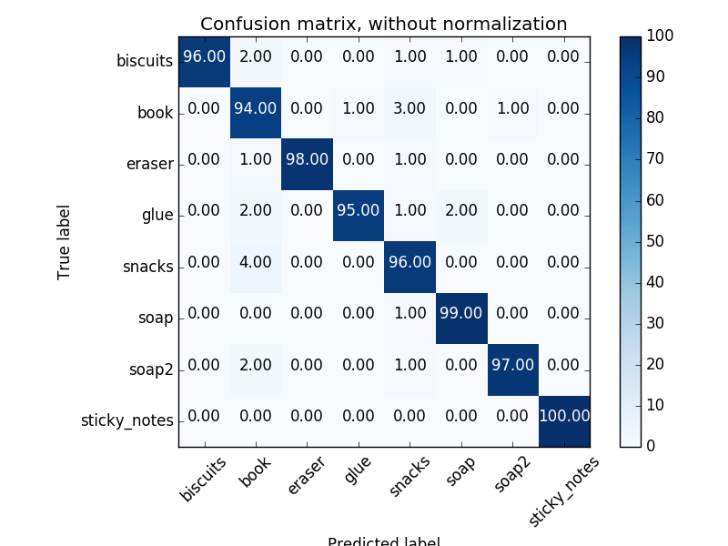
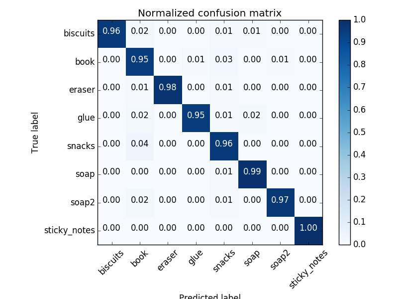
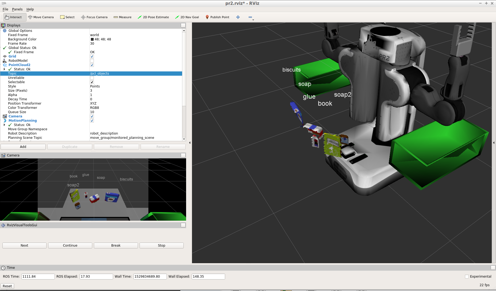
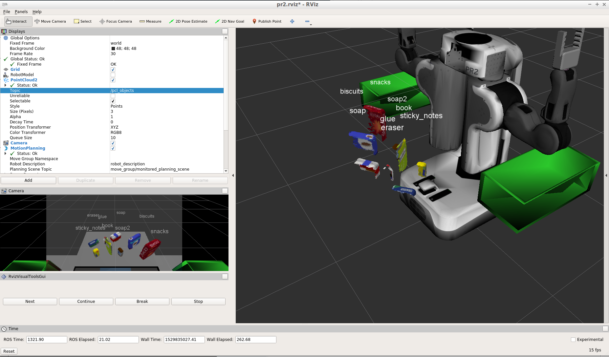

## Project: Perception Pick & Place

My solution of RoboND-Perception-Project assignment from Udacity Robotics Nanodegree course, Term 1.
See project assignment starter code in https://github.com/udacity/RoboND-Perception-Project

All the relevant files are held in ```RoboND-Perception-Project/pr2_robot/scripts``` folder: 
* ```capture_features.py``` extracts point features for training a classifier, saving them into ```training_set.sav```
* ```train_svm.py``` trains Support Vector Machine classifier, saving its parameters into ```model.sav```
* ```project_template.py``` filters out noise, groups points into clusters, extracts features and classifies objects via
```model.sav```, sending relevant commands to PR2. The robot commands are logged into ```output_1.yaml```, ```output_2.yaml``` and
```output_3.yaml``` files, dependently on the selected world.


### Here I will consider the rubric points individually and describe how I addressed each point in my implementation.  

### Writeup / README

#### 1. Provide a Writeup / README that includes all the rubric points and how you addressed each one.  You can submit your writeup as markdown or pdf.  

You're reading it!

### Exercise 1, 2 and 3 pipeline implemented


#### 1. Complete Exercise 1 steps. Pipeline for filtering and RANSAC plane fitting implemented.

```project_template.py``` implements all the steps from Exercise 1:

1. ```filter_passthrough_vertical()``` and ```filter_passthrough_horizontal()``` exclude points that are outside the region
of interest. These points may belong to the part of the table, the floor or the robot. 

2. ```filter_voxel_grid()``` decreases number of points and removes noise by spliting the region of interest into
rectangular 3D grid, saving only an average point per each cell in the grid.

3. ```filter_remove_outliers()``` removes alienated points that are not surrounded by neighbours. Such points are usually
caused by sensor noise rather than reflections from any real object.

4. ```filter_remove_table()``` removes points belonging to a table by fitting plane with RANSAC algorithm and leaving only
objects not belonging to that plane

The remaining points are published into ```/pcl_objects``` channel.

#### 2. Complete Exercise 2 steps: Pipeline including clustering for segmentation implemented.  

```project_template.py``` also holds the step from Exercise 2:

```extract_clusters()``` takes point coordinates and unites them into clusters. Each cluster holds points belonging to
a separate object. Only point coordinates and euclidian distance are used to decide if the point belongs to the same
cluser or not. A point belongs to a cluster if there are at least 25 neighbours at the distance not exceeding 3 cm.

This process additionally eliminates alienated points, completely removing outliers and leaving only useful information.

The colored clusters are dumped into ```/pcl_cluster``` channel.

#### 2. Complete Exercise 3 Steps.  Features extracted and SVM trained.  Object recognition implemented.

To extract features for object recognition, ```pcl_callback()``` from ```project_template.py``` calls
```compute_color_histograms()``` and ```compute_normal_histograms``` of ```sensor_stick.features```, implemented 
within the scope of RoboND-Peception-Exercises. The file is available in my GitHub repository, in 
https://github.com/dimaga/RoboND-Perception-Exercises/blob/master/Exercise-3/sensor_stick/src/sensor_stick/features.py

* ```compute_normal_histograms()``` returns histograms of three normal coordinates: x, y and z.

* ```compute_color_histograms()``` returns histograms of colors in HSV space.

```project_template.py``` uses a model trained by ```train_svm.py``` script. ```capture_features.py``` extracts features
100 times per each model, randomly rotating it near camera sensor. Such an approach allows to achieve 0.97 accuracy with
the following confusion matrices:




### Pick and Place Setup

#### 1. For all three tabletop setups (`test*.world`), perform object recognition, then read in respective pick list (`pick_list_*.yaml`). Next construct the messages that would comprise a valid `PickPlace` request output them to `.yaml` format.

```pr2_mover()``` function of ```project_template.py``` iterates the pick list. If it the picked item is recognized,
its centroid is calculated and a corresponding arm is assigned. Then the motion command is sent to the robot. As soon
as all the robot commands are executed, the corresponding ```output_*.yaml``` file is formed.

All generated ```output_*.yaml``` files are available in ```RoboND-Perception-Project/pr2_robot/scripts``` folder.
According to ```output_*.yaml``` and screenshots that follow, my perception code classifies all objects correctly:     





#### Ideas on further enhancements

* After detecting table plane by RANSAC algorithm, remove all points that are below it. This should be more robust than
hard-coded pass-through filter values

* In addition to point normals, consider using more advanced point features from PCL library. See details in https://github.com/PointCloudLibrary/pcl/wiki/Overview-and-Comparison-of-Features

* For more challenging cases with more noise and more diverse object classes, consider using deep learning approach, similar to VoxelNet: https://github.com/PointCloudLibrary/pcl/wiki/Overview-and-Comparison-of-Features

